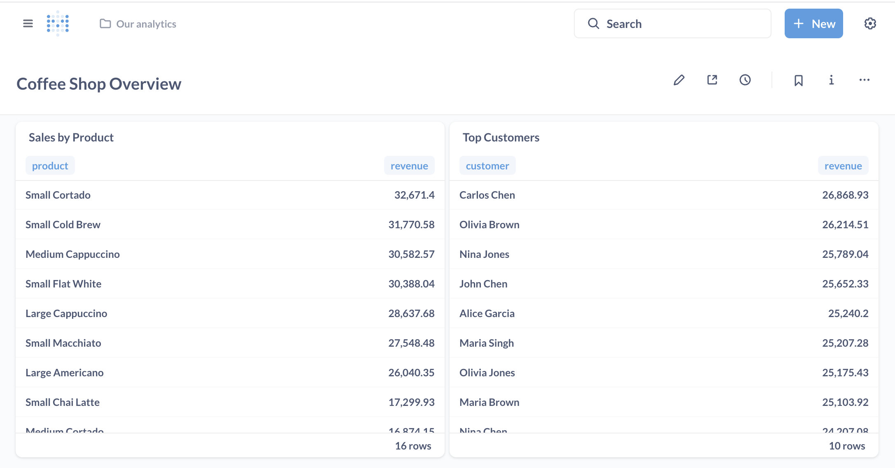
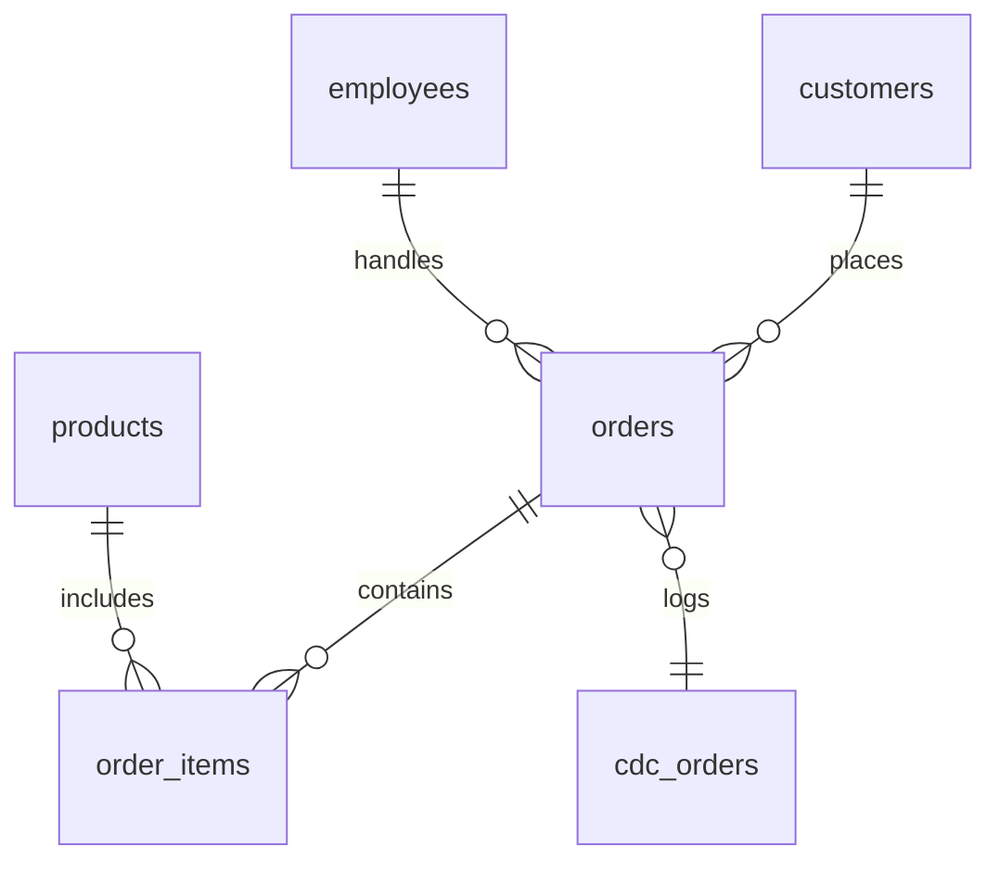
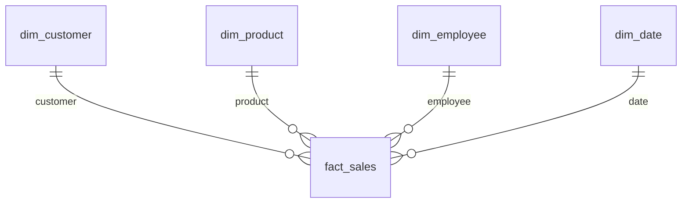

# Brewlytics

**From espresso shots to insights — your coffee shop data pipeline.**

Brewlytics is a full-stack data engineering playground disguised as a coffee shop. It simulates a real-world analytics system where every cappuccino, croissant, and customer sneeze can be tracked, replicated, and visualized.

Whether you're brewing orders, piping SQL, or stirring Airflow DAGs, Brewlytics keeps your data hot and dashboards even hotter.

## Project Purpose and Business Intelligence

The goal of Brewlytics is to simulate the creation of a full-fledged Business Intelligence (BI) warehouse for a modern coffee shop. While the orders, products, and employees may be fictional, the underlying architecture and data workflows mirror those used in real-world retail and food service analytics.

### Why Business Intelligence?

A typical coffee shop handles thousands of transactions, customer interactions, and inventory changes daily. BI helps convert that raw operational data into actionable insights such as:

* Identifying peak hours and staffing accordingly
* Highlighting best-selling items or underperforming products
* Tracking sales trends by day, employee, or customer segment
* Detecting operational bottlenecks or anomalies in ordering patterns

### Why a Data Warehouse?

Operational (OLTP) databases are optimized for transactions — fast reads and writes. But answering complex analytical questions (e.g., "How did latte sales trend over the past 6 weeks by employee?") requires joining large datasets across time, dimensions, and measures. A data warehouse (OLAP) separates analytical workloads, allowing fast, clean reporting.

### How OLAP Star Schema Helps

Brewlytics transforms raw CDC logs from the transactional system into a clean, analytical star schema. This includes:

* **Fact tables**: e.g., `fact_sales` contain quantitative data like revenue, quantity, and timestamps.
* **Dimension tables**: e.g., `dim_customer`, `dim_product`, `dim_employee` provide rich context for slicing and dicing the facts.

This schema enables tools like Metabase to generate dashboards that:

* Easily filter and group data by dimensions (e.g., daily sales by product)
* Run fast queries thanks to denormalized design
* Support trend analysis, ranking, and time-series exploration

Below is a sample Metabase dashboard visualizing OLAP insights:



## Features

* RESTful API to simulate the life of a bustling coffee shop
* PostgreSQL (OLTP) with a custom CDC table — like a diary for your database
* Airflow DAGs that wake up every few minutes to gossip about what changed
* PostgreSQL (OLAP) with a beautiful star schema — because snowflakes are for the weak
* K6 load testing scripts that stress your API like a Monday morning rush
* Metabase dashboards to show your barista who's really running the shop
* All containerized, because who wants to install things manually in 2025?
* dbt models transform raw data into analytics-ready tables
* Pytest integration tests ensure the whole pipeline works

## Architecture Overview

1. **OLTP**: Orders go into a transactional database (and occasionally, into chaos)
2. **CDC Logging**: Triggers log every change, so you never miss a latte
3. **Airflow ETL**: DAGs extract the drama and load it into your data warehouse
4. **OLAP Star Schema**: Fact tables tell the cold, hard truth; dimensions add flavor
5. **Metabase BI**: Turn data into beautiful charts your boss will nod at
6. **K6 Load Testing**: Simulate customer rush without ever spilling a real coffee

## Technology Stack

| Layer                | Tool/Service      |
| -------------------- | ----------------- |
| API                  | FastAPI / Express |
| OLTP DB              | PostgreSQL        |
| ETL Orchestration    | Apache Airflow    |
| OLAP Warehouse       | PostgreSQL        |
| Schema Migrations    | Flyway            |
| Data Transformations | dbt               |
| Load Testing         | K6                |
| BI Dashboard         | Metabase          |
| Containerization     | Docker Compose    |

## Data Model

### OLTP Schema



### OLAP Star Schema



## Quick Start

### Prerequisites

* Docker
* Docker Compose
* Enough caffeine

### Clone the Repository

```bash
git clone https://github.com/babanomania/brewlytics.git
cd brewlytics
cp .env.sample .env
```

Update the `.env` file with the following variables for Metabase:

```env
METABASE_USER=admin@brewlytics.local
METABASE_PASSWORD=admin123
```

These credentials will be used to log in via the Metabase API and automate dashboard creation.

### Start the System

```bash
docker-compose up --build
```

All Postgres containers (oltp-db, olap-db, metabase-db) store their data in named volumes, so your databases survive `docker-compose down`. The `k6` container is disabled by default using a Compose profile.

* API Gateway: `http://localhost:8000`
* Airflow: `http://localhost:8080`
* Metabase: `http://localhost:3000`

### Environment Variables

```text
DB_USER=brew
DB_PASSWORD=brew
OLTP_DB=coffee_oltp
OLAP_DB=coffee_olap
METABASE_DB=metabase
METABASE_USER=admin@brewlytics.local
METABASE_PASSWORD=admin123
AIRFLOW_DB=airflow
AIRFLOW_USER=admin
AIRFLOW_PASSWORD=admin
```

### Generate Sample Data

```bash
docker-compose run dbt_oltp
```

```bash
docker-compose run dbt_olap
```

## API Endpoints

* `POST /orders/new`
* `POST /products/new`
* `POST /customers/new`
* `GET /employees/active`

## Airflow DAGs

* DAG name: `cdc_to_star`
* Found in `airflow-pipeline/dags/`

## Load Testing with K6

```bash
docker-compose --profile k6 run k6
```

## Dashboards

After the initial Metabase setup wizard, complete the following:

1. Login to [Metabase](http://localhost:3000) using the credentials from `.env`.

2. Complete the setup wizard, skip sample data.

3. Add a new PostgreSQL data source:

   * Host: `olap-db`
   * Port: `5432`
   * DB Name: `coffee_olap`
   * Username: `brew`
   * Password: `brew`

4. Once setup is complete, run the following command to auto-generate a dashboard and a few example charts:

```bash
docker-compose --profile metabase-setup run --rm metabase-setup
```

This invokes `setup_dashboards.py`, which uses the Metabase API to:

* Authenticate with your Metabase instance
* Create a dashboard
* Create a few example charts
* Add those charts to the dashboard

The script reads `METABASE_USER`, `METABASE_PASSWORD`, and the dashboard config from `metabase/dashboard.json`.

You can edit this file to change chart configurations, or extend the script for more complex automation.

## Running Tests

```bash
docker-compose --profile tests run --rm pytest
```

## Folder Structure

```
.
├── backend-api/
│   ├── order-api/
│   ├── product-api/
│   └── customer-api/
├── airflow-pipeline/
├── dbt/
├── flyway/
│   ├── migrations/oltp/
│   └── migrations/olap/
├── k6-loadtest/
├── metabase/
├── tests/
└── docker-compose.yml
```

## License

MIT License. Use it, remix it, deploy it at your local café. Just don't serve cold coffee.
