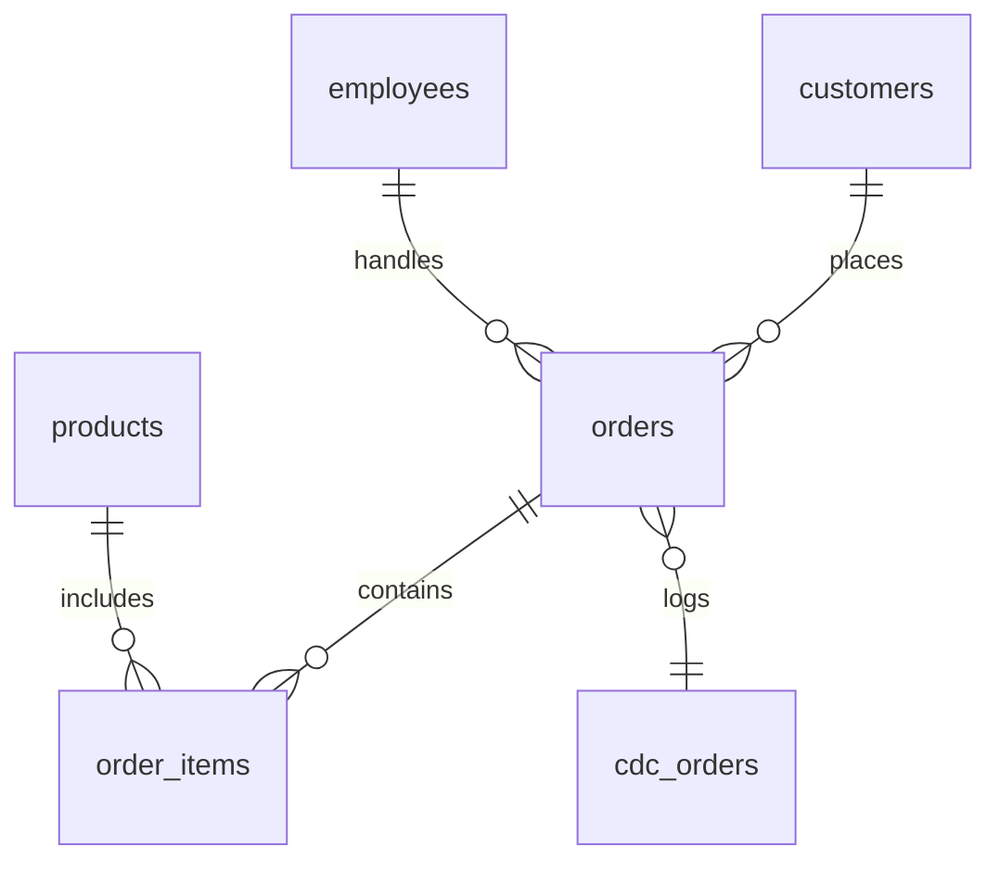
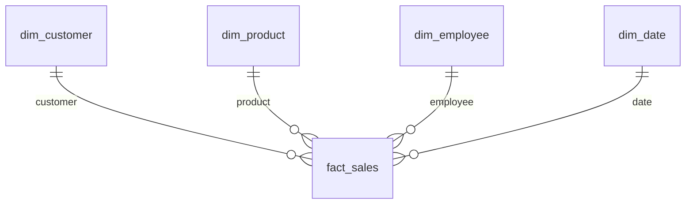

# Brewlytics

**From espresso shots to insights — your coffee shop data pipeline.**

Brewlytics is a full-stack data engineering playground disguised as a coffee shop. It simulates a real-world analytics system where every cappuccino, croissant, and customer sneeze can be tracked, replicated, and visualized.

Whether you're brewing orders, piping SQL, or stirring Airflow DAGs, Brewlytics keeps your data hot and dashboards even hotter.

## Features

* RESTful API to simulate the life of a bustling coffee shop
* PostgreSQL (OLTP) with a custom CDC table — like a diary for your database
* Airflow DAGs that wake up every few minutes to gossip about what changed
* PostgreSQL (OLAP) with a beautiful star schema — because snowflakes are for the weak
* K6 load testing scripts that stress your API like a Monday morning rush
* Metabase dashboards to show your barista who's really running the shop
* All containerized, because who wants to install things manually in 2025?
* dbt models transform raw data into analytics-ready tables
* Pytest integration tests ensure the whole pipeline works


## Architecture Overview

1. **OLTP**: Orders go into a transactional database (and occasionally, into chaos)
2. **CDC Logging**: Triggers log every change, so you never miss a latte
3. **Airflow ETL**: DAGs extract the drama and load it into your data warehouse
4. **OLAP Star Schema**: Fact tables tell the cold, hard truth; dimensions add flavor
5. **Metabase BI**: Turn data into beautiful charts your boss will nod at
6. **K6 Load Testing**: Simulate customer rush without ever spilling a real coffee

## Technology Stack

| Layer             | Tool/Service      |
| ----------------- | ----------------- |
| API               | FastAPI / Express |
| OLTP DB           | PostgreSQL        |
| ETL Orchestration | Apache Airflow    |
| OLAP Warehouse    | PostgreSQL        |
| Schema Migrations | Flyway            |
| Data Transformations | dbt            |
| Load Testing      | K6                |
| BI Dashboard      | Metabase          |
| Containerization  | Docker Compose    |

## Data Model

### OLTP Schema



### OLAP Star Schema




## Quick Start

### Prerequisites

* Docker
* Docker Compose
* Enough caffeine

### Clone the Repository

```bash
git clone https://github.com/babanomania/brewlytics.git
cd brewlytics
cp .env.sample .env
# Review and adjust values in `.env` if needed
```

### Start the System

```bash
docker-compose up --build
```
All Postgres containers (oltp-db, olap-db and metabase-db) store their data in named volumes, so your databases survive `docker-compose down`.
The `k6` load-testing container is disabled by default using a Compose profile, so it won't start automatically.

* API Gateway: `http://localhost:8000`
* Airflow: `http://localhost:8080`
* Metabase: `http://localhost:3000`
* Flyway runs automatically to provision all databases

If everything works, pat yourself on the back. If not, blame YAML.

### Environment Variables

All services read their database credentials from the `.env` file. The most
important settings are:

```text
DB_USER=brew
DB_PASSWORD=brew
OLTP_DB=coffee_oltp
OLAP_DB=coffee_olap
MB_DB=metabase
```

These variables are passed to Flyway, Airflow, dbt and the integration tests.
Customize them in `.env` if you need different credentials.

### Generate Sample Data

Flyway provisions both databases automatically. To load additional sample
customers and products, use dbt seeds:

```bash
docker-compose run dbt_oltp
```

This inserts a few extra records into the OLTP database using the CSV files in
the `dbt/seeds` folder.

To run analytical transformations with dbt models:

```bash
docker-compose run dbt_olap
```

This populates helper tables like `daily_sales` in the OLAP database.

## API Endpoints

* `POST /orders/new`: Place an order (latte not included)
* `POST /products/new`: Add a new drink or snack
* `POST /customers/new`: Register your most loyal caffeine addict
* `GET /employees/active`: Fetch active employees for order assignment

Each order automatically gets logged into the CDC table, because data is sacred.

## Airflow DAGs

* Found in `airflow-pipeline/dags/`
* `cdc_to_star` DAG extracts new events and fills the OLAP like a shot of espresso
* Runs every 5 minutes, just like a properly tuned espresso machine

To trigger the DAG manually, open [Airflow](http://localhost:8080) and log in with
`admin` / `admin`. Click the play button next to `cdc_to_star`.

## Load Testing with K6

Want to simulate the morning rush?

```bash
docker-compose --profile k6 run k6
```

K6 will bombard your API like a line of customers 2 minutes before closing.

## Dashboards

Use Metabase to visualize sales trends, best-selling items, and which employee is secretly upselling muffins.

Connect Metabase to the OLAP PostgreSQL database.

1. Visit [Metabase](http://localhost:3000) and create an admin user.
2. Add a new PostgreSQL database using host `olap-db`, port `5432`, user `brew`,
   password `brew`, and database `coffee_olap`.
3. (Optional) customise `metabase/dashboard.json` and run
   `python metabase/setup_dashboards.py` to create an example dashboard
   automatically. The script reads the config file path from the
   `DASHBOARD_CONFIG` environment variable (defaults to `metabase/dashboard.json`).

You can also customise the dashboard by providing a JSON config file and
running `python metabase/setup_dashboards.py`. The script reads the file
path from the `DASHBOARD_CONFIG` environment variable (defaults to
`metabase/dashboard.json`).

## Running Tests

Make sure the stack is running (`docker-compose up`). In another terminal, run:

```bash
pytest tests/
```

This test suite verifies that an order flows from the API through Airflow into the OLAP database.
## Folder Structure
```
.
├── backend-api/
│   ├── order-api/       # Order service
│   ├── product-api/     # Product service
│   └── customer-api/    # Customer service
├── airflow-pipeline/    # Airflow DAGs and config
├── dbt/                 # dbt seeds and models
├── flyway/
│   ├── migrations/oltp/ # OLTP Flyway migrations
│   └── migrations/olap/ # OLAP Flyway migrations
├── k6-loadtest/         # K6 performance testing scripts
├── metabase/            # BI setup scripts
├── tests/               # Pytest integration tests
└── docker-compose.yml   # The real MVP
```

## License

MIT License. Use it, remix it, deploy it at your local café. Just don't serve cold coffee.
